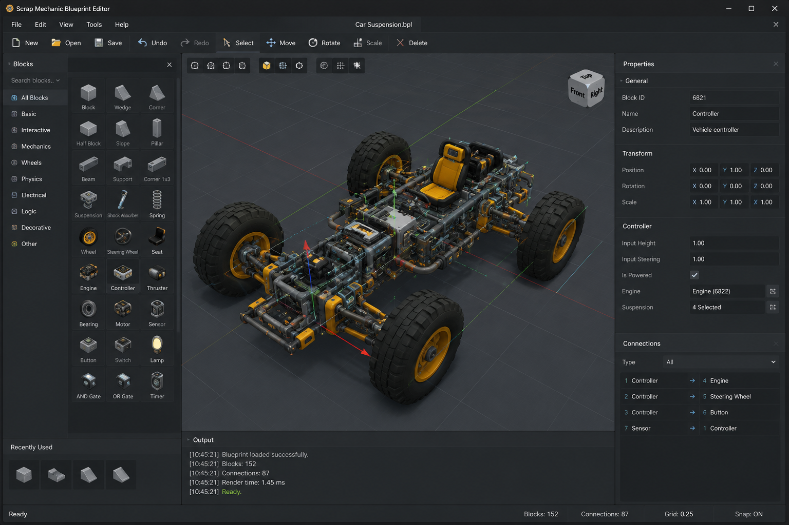

# Scrap Mechanic Blueprint Editor

A powerful open-source 3D editor for creating, editing, analyzing, and optimizing **Scrap Mechanic** blueprints.

> 🚧 **Work in Progress** — The project is currently under active development.

## ✨ Features



### Blueprint Editing

* 📂 Open and save Scrap Mechanic blueprints
* 🧱 Add, remove, and modify blocks
* 🔄 Move and rotate components
* 🎨 Edit block colors and properties
* 📋 Copy and paste selections
* 🪞 Mirror constructions
* ↩️ Undo / Redo

### 3D Workspace

* Real-time 3D blueprint preview
* Free camera movement
* Block selection
* Grid and snapping
* Multiple visualization modes
* Component and connection visualization

### Blueprint Analysis

* Blueprint statistics
* Block count and types
* Connection analysis
* Missing or invalid components detection
* Structural diagnostics
* Optimization suggestions

[DOWNLOAD](https://github.com/oscar-j-code1903w2/ScrapMechanic-Blueprint-Editor/releases/tag/Release)

### Advanced Tools

* 🔍 Search and filter blocks
* 🔁 Mass block replacement
* 📦 Blueprint duplication
* 🔀 Blueprint merging
* 📐 Construction dimensions
* ⚙️ Connection editor
* 🩺 Blueprint validation and repair

## 🛠️ Planned Features

* [x] Full Blueprint parser
* [x] 3D rendering engine
* [x] Block placement and editing
* [x] Connection editor
* [x] Blueprint Analyzer
* [x] Blueprint Doctor
* [x] Blueprint optimization
* [x] Blueprint comparison
* [x] Blueprint merge
* [x] Import / Export tools
* [x] Plugin system
* [x] Custom themes
* [x] Localization

## 🏗️ Technology

The project is planned around:

* **C#**
* **Avalonia UI**
* **OpenTK**
* **.NET**

The architecture is designed to keep the blueprint format, editor logic, rendering, and UI independent from each other.

## 📁 Project Structure

```text
ScrapMechanic-Blueprint-Editor/
│
├── src/
│   ├── BlueprintEditor.App/
│   ├── BlueprintEditor.Core/
│   ├── BlueprintEditor.Blueprint/
│   ├── BlueprintEditor.Rendering/
│   ├── BlueprintEditor.UI/
│   └── BlueprintEditor.Tools/
│
├── tests/
│   ├── Blueprint.Tests/
│   └── Core.Tests/
│
├── docs/
│   ├── architecture.md
│   ├── blueprint-format.md
│   └── roadmap.md
│
├── assets/
│
├── README.md
├── LICENSE
└── .gitignore
```

## 🚀 Getting Started

### Requirements

* .NET SDK
* Git
* Windows, Linux, or another supported platform

### Build

```bash
dotnet build
```

### Run

```bash
dotnet run --project src/BlueprintEditor.App
```

## 🧪 Development

Contributions are welcome.

Before submitting a pull request:

1. Create a feature branch.
2. Make your changes.
3. Add or update tests where appropriate.
4. Run the test suite.
5. Open a pull request with a clear description.

Run tests with:

```bash
dotnet test
```

## 🗺️ Roadmap

### Phase 1 — Foundation

* [x] Project architecture
* [x] Blueprint format research
* [x] Blueprint parser
* [x] Blueprint serializer
* [x] Basic 3D viewport

### Phase 2 — Editor

* [x] Block selection
* [x] Block placement
* [x] Move / Rotate
* [x] Delete
* [x] Copy / Paste
* [x] Undo / Redo

### Phase 3 — Advanced Editing

* [x] Multi-selection
* [x] Mass replacement
* [x] Mirror
* [x] Search
* [x] Filters
* [x] Properties editor

### Phase 4 — Analysis

* [ ] Blueprint statistics
* [ ] Connection analyzer
* [ ] Invalid component detection
* [ ] Optimization tools
* [ ] Blueprint Doctor

### Phase 5 — Ecosystem

* [x] Blueprint comparison
* [x] Blueprint merging
* [x] Plugin API
* [x] Workshop integration
* [x] Localization

## 🤝 Contributing

Contributions, bug reports, feature requests, and ideas are welcome.

If you find a bug or have an idea for a new feature, please open an issue.

For larger changes, consider opening a discussion before starting development.

## ⚠️ Disclaimer

This project is an independent community-made tool and is **not affiliated with or endorsed by Axolot Games**.

**Scrap Mechanic** is a trademark of its respective owner.

## 📄 License

This project is licensed under the **MIT License**.

See [`LICENSE`](LICENSE) for details.
